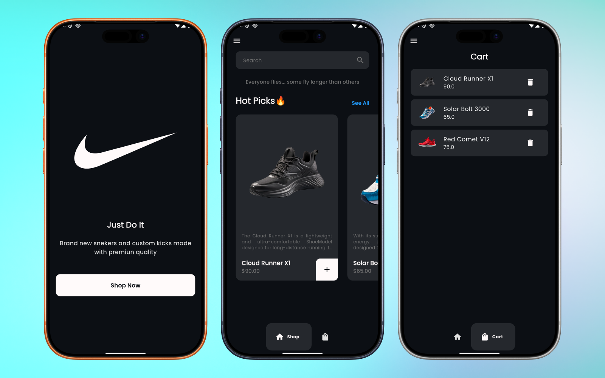

# snekers_shop

A small Flutter demo shop app that showcases a product listing (sneakers), a cart powered by Provider, and a simple navigation flow using go_router. This project is a good starting point for learning small-scale app structure, theming, and state management in Flutter.



---

## Table of contents
- [Features](#features)
- [Demo](#demo)
- [Prerequisites](#prerequisites)
- [Getting started](#getting-started)
- [Running tests](#running-tests)
- [Project structure (important files)](#project-structure-important-files)
- [Architecture & Implementation details](#architecture--implementation-details)
- [Code examples](#code-examples)
- [Customization](#customization)
- [Troubleshooting & notes](#troubleshooting--notes)
- [Contributing](#contributing)
- [License](#license)

---

## Features
- Product list of sneakers with images, descriptions and prices.
- Add items to a cart and remove items from the cart.
- Local state management using Provider (CartProvider).
- Navigation with go_router (intro -> home).
- Light and dark themes with easily editable color constants.
- Assets loaded from `assets/images/`.

---

## Demo

Product listing and cart pages are demonstrated in the mockup below.


---

## Prerequisites
- Flutter SDK >= 3.10.7 (see `pubspec.yaml` environment)
- Android Studio / Xcode or other platform-specific tooling to run on emulators/devices
- Basic familiarity with Flutter and Dart

---

## Getting started

1. Clone the repository
   ```
   git clone https://github.com/fathorrosi-dev/snekers_shop.git
   cd snekers_shop
   ```

2. Get dependencies
   ```
   flutter pub get
   ```

3. Run the app
   - On the default device/emulator:
     ```
     flutter run
     ```
   - Choose a specific device:
     ```
     flutter run -d <device-id>
     ```
   - Build release APK (Android):
     ```
     flutter build apk --release
     ```

4. Navigate the app:
   - The app starts at the intro screen (`/`), then you can go to the home screen (`/homeScreen`) which contains Shop and Cart pages.

---

## Running tests
A basic widget test scaffold is present. Run tests with:
```
flutter test
```

---

## Project structure (important files)
- `lib/main.dart` — App entrypoint; wires up Provider and router.
- `lib/screen/utils/router.dart` — `go_router` routes ("/" intro, "/homeScreen" home).
- `lib/model/shoe_model.dart` — Shoe data model (name, description, price, imageUrl).
- `lib/provider/cart_provider.dart` — Cart state (add/remove, list).
- `lib/screen/home_screen/home_screen.dart` — Main layout, drawer and bottom navigation.
- `lib/screen/home_screen/components/shop_page.dart` — Product listing UI.
- `lib/screen/home_screen/components/cart_page.dart` — Cart UI and list.
- `lib/screen/home_screen/components/shoe_card.dart` — Card widget for each shoe + add-to-cart button.
- `lib/screen/home_screen/components/cart_item.dart` — Cart item widget + delete action.
- `lib/screen/styles/theme.dart` & `lib/screen/utils/constants/colors.dart` — Theming and color constants.
- `assets/images/` — Images used in the app; make sure `assets` is declared in `pubspec.yaml`.

---

## Architecture & Implementation details

- State Management
  - Provider (`provider` package) is used for app-level state: `CartProvider` (in `lib/provider/cart_provider.dart`).
  - Public methods available in `CartProvider`:
    - `List<ShoeModel> getShoeList()` — returns seeded product list (from `shoe_list.dart`).
    - `List<ShoeModel> getUserCart()` — returns current cart items.
    - `void adaItemToCart(ShoeModel shoe)` — adds a shoe to the cart and notifies listeners. (Note: method name has a small typo — see Troubleshooting.)
    - `void removeItemFromCart(ShoeModel shoe)` — removes an item from the cart and notifies listeners.

- Routing
  - `go_router` provides simple declarative routing. Routes are defined in `lib/screen/utils/router.dart`:
    - `/` → `IntroScreen`
    - `/homeScreen` → `HomeScreen`

- Theming
  - `lib/screen/styles/theme.dart` defines light and dark `ThemeData` instances (AppTheme.lightTheme, AppTheme.darkTheme).
  - Colors are centralized in `lib/screen/utils/constants/colors.dart` (AppColors).

- Models & Data
  - `ShoeModel` (lib/model/shoe_model.dart) is a simple plain data class.
  - The seeded product list is in `lib/screen/home_screen/components/shoe_list.dart`.

- Assets
  - Images are stored in `assets/images/` and referenced in `pubspec.yaml` under `assets:`.

---

## Code examples

- Add an item to the cart from a widget (the app uses this pattern in `ShoeCard`):
```dart
// inside a widget method
Provider.of<CartProvider>(context, listen: false).adaItemToCart(shoe);
```

- Read cart contents:
```dart
final cart = Provider.of<CartProvider>(context).getUserCart();
```

- Remove an item from the cart:
```dart
Provider.of<CartProvider>(context, listen: false).removeItemFromCart(shoe);
```

- Navigate using go_router:
```dart
// push to home screen
context.go('/homeScreen');
```

---

## Customization

- Change theme colors:
  - Edit `lib/screen/utils/constants/colors.dart` and adjust `AppColors`.
  - Update `lib/screen/styles/theme.dart` if you need to adjust typography or global theme settings.

- Add/modify products:
  - Edit `lib/screen/home_screen/components/shoe_list.dart`. Add new `ShoeModel` instances with local image paths.

- Add assets:
  - Place images in `assets/images/` and declare them in `pubspec.yaml` (already configured for that folder).
  - Use `Image.asset('assets/images/your_image.png')` in widgets.

- Rename provider methods (optional cleanup):
  - `adaItemToCart` appears to be a typo and may be renamed to `addItemToCart` if you update the provider and all usages.

---

## Troubleshooting & notes
- Method name: `adaItemToCart` — If you prefer a clearer name, rename it to `addItemToCart` in `lib/provider/cart_provider.dart` and update corresponding calls (e.g., in `ShoeCard`).
- Make sure your Flutter device/emulator has enough memory to load several PNG assets (images in `assets/images/` can be large).
- If you change assets or pubspec, run:
  ```
  flutter pub get
  flutter clean
  flutter run
  ```

---

## Contributing
Contributions are welcome. A suggested workflow:
1. Fork the repository.
2. Create a feature branch: `git checkout -b feat/your-feature`
3. Make changes and add tests where appropriate.
4. Submit a pull request with a clear description of your changes.

Please add a LICENSE file if you intend to accept contributions under a specific license.

---

## License
This repository currently does not include a license file. If you plan to publish or accept contributions, consider adding a LICENSE (for example, MIT).

---

If you want, I can:
- Add a CONTRIBUTING.md template,
- Rename the provider method to `addItemToCart` with a small patch,
- Or create a small CI workflow to run `flutter test` on push.